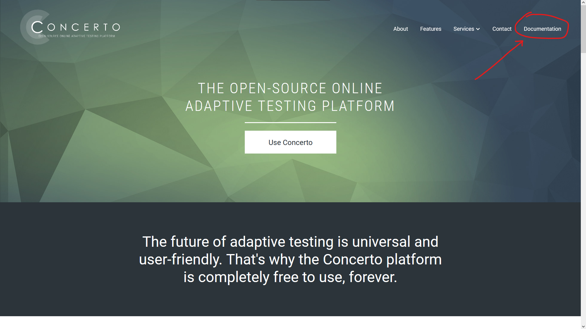
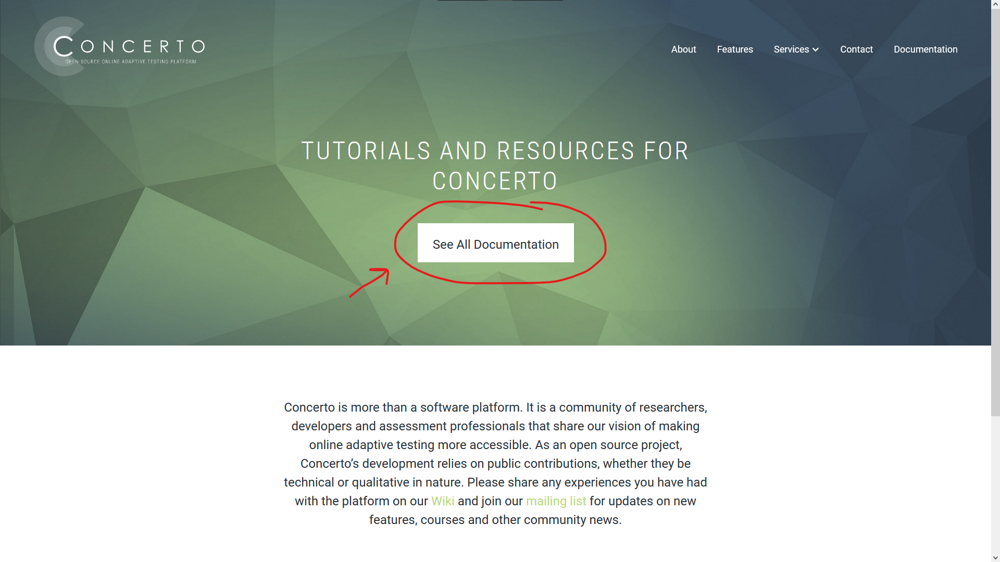
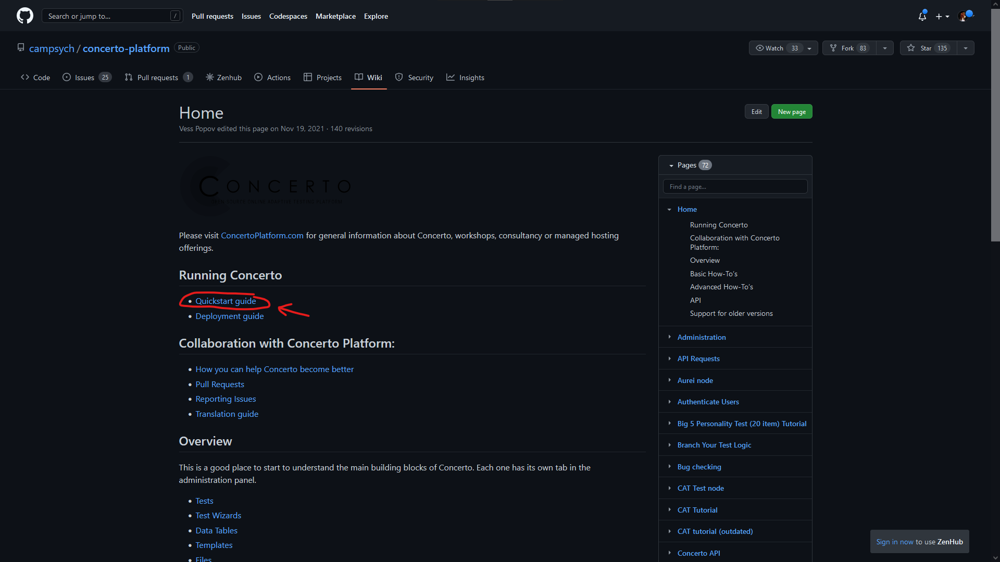
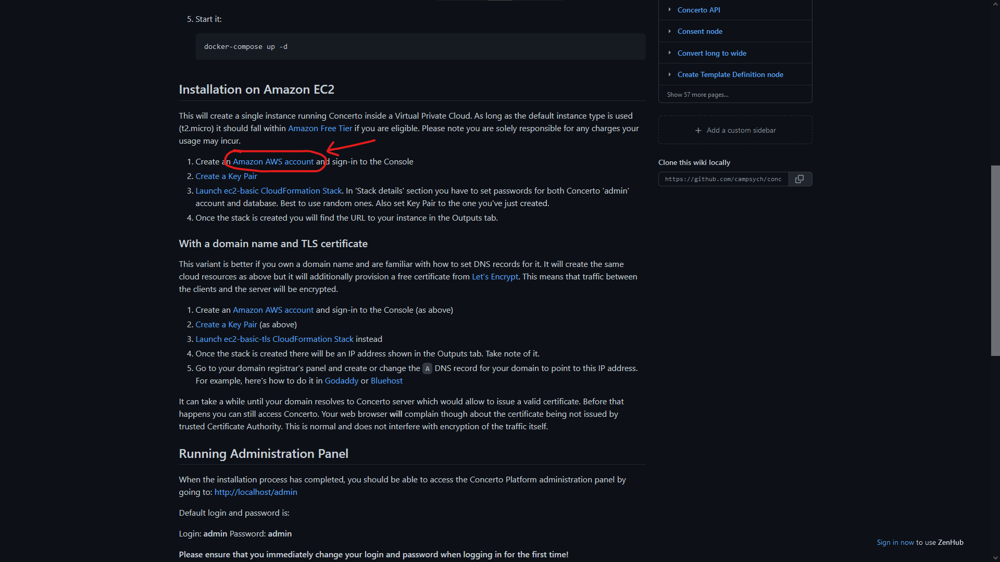
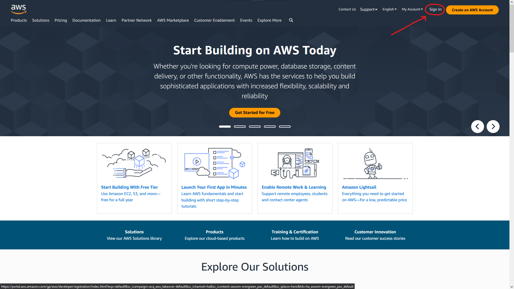
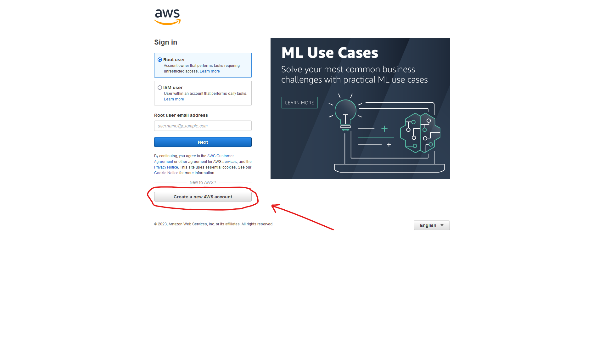

<h1 style="font-size:36pt;">CBU Concerto Capstone</h1>

### _2022-2023_ 

<!-- This content will not appear in the rendered Markdown -->

<!-- 

- [x] paste all of the documentation to github
- [ ] add images to the github
- [ ] format the documentation
- [ ] share the page:tada:

~~This was mistaken text~~

hehe This is a subscript text

hehe This is a superscript text

[link to github readme syntax](https://docs.github.com/en/get-started/writing-on-github/getting-started-with-writing-and-formatting-on-github/basic-writing-and-formatting-syntax)

[Advanced syntax](https://docs.github.com/en/get-started/writing-on-github/working-with-advanced-formatting)

 -->

# Concerto Documentation

###

Period of Performance: 09/24/2022 – 04/25/2023 
_Tyler Adcock / Jacob Eaton / Ezekiel Ramirez / Christopher Schilling_

###

EGR301-302 Capstone Design and Presentation
Dr. Mark Gordon

###

**Previous Developers**

#####

Period of Performance: 01/24/2020 – 04/25/2020
_Josh Freeman / Grimaldy Gunawan / Riley Verdier_

# Table of Contents

1. [General Context](#1-general-context)
2. [Introduction](#2-introduction)
3. [Setting Up Concerto](#3-setting-up-concerto)
4. [Navigating Concerto](#4-navigating-concerto)
5. [Advanced R Script Explanations](#5-advanced-r-script-explanations)
6. [References and Tools](#6-references-and-tools)
7. [Troubleshooting](#7-troubleshooting)
8. [Debugging](#8-debugging)
9. [Video Instructions](#9-video-instructions)

# 1. General Context
	
## 1.1 - Purpose
This document is created to illustrate the uses and capabilities of the Concerto platform. In here users of the Concerto platform will find all the necessary tools and instructions to create proper Computerized Adaptive Tests (CAT). 

## 1.2 - Concerto Overview
The University of Cambridge Psychometrics Centre believes that online adaptive testing should be available to everyone. 
That is why we’ve built Concerto: a powerful and user-friendly platform that empowers experts and beginners alike to make better tests, without needing to write a single line of code. 
There are no set-up costs, no hidden license fees and no limitations. 
This ensures our community of researchers and practitioners can take on both short- and long-term assessment projects with confidence.

Concerto harmonizes the statistical power of the R programming language, the security of MySQL databases and the flexibility of HTML to deliver an outstanding performance.
These instruments work in unison, giving users unparalleled freedom and control over the design of their assessments.
In-built algorithms for score calculation and report generation ensure a rewarding experience for participants, whatever the context.

# 2. Introduction

## 2.1 - An Overview of Concerto

Concerto is an open source Computer Assisted Testing(CAT) platform. This platform allows admin users to generate various forms of online tests for students to take. CAT tests are only one type of test that Concerto is capable of generating. In order to use Concerto, admin users have to have access to an instance of Concerto, usually ran on an Amazon EC2. In order to execute, Concerto uses a mixture of html, CSS, and Php, as well as a language called R which is made for mathematical calculations, similar to MatLab.
After logging into Concerto, there are a series of different tabs representing different features Concerto has. To summarize how Concerto works, there are two major sections of the interface that make up the bulk of Concerto’s functionality:

- Tests: are generated by admins and while the name would indicate that they are just the tests for students to take, they are basically just a series of “nodes” that concerto executes including nodes containing R scripts. This means that while their primary purpose is to generate a test for students to take, they are also able to be used for other purposes such as operating on data in the Concerto instance.
- Data Tables: are built in SQL data tables that can be accessed to generate questions for tests, as well as hold response data, user data, or any other data that can be held in an SQL table. These tables can be accessed either through a “Data Manipulation” node, or through a function call in an R script.

# 3. Setting Up Concerto

This section will provide the proper instruction for users to set up their Concerto platform. Users will have a better understanding of how to properly set up their system to conform to Concerto restrictions.

## 3.1 - Navigating the Concerto Website

First, we will begin by visiting the concerto website by clicking on the link below:

[Concerto Website](https://concertoplatform.com/)

Once on the website we want to go click on the documentation tab in the top right-hand corner. See the image below:

This will open a web page. Click on the “SEE ALL DOCUMENTATION” button in the middle of the screen on this page.

## 3.2 - AWS Account

If you already have an Amazon AWS account fill free to skip to [ section 3.3.2](#332---creating-a-key-pair)

The Concerto Documentation Web Page should now pop up.
Click on the “QuickStart Guide” that is under the heading “Running Concerto”.

This link will direct you to a page where Concerto will show the user how to set up Concerto on your machine. We __DO NOT__ want to use their guide. Instead, please follow this documentation to minimize the likelihood of running into errors.

Scroll down to the “Installation on Amazon EC2”. Under this subheading click on the “Amazon AWS account” link.

## 3.3 - AWS Setup

This will direct you through the Amazon AWS page.

In order for Concerto to be docked into your machine we must first create an Amazon AWS account.

### 3.3.1 - Creating an Amazon AWS account

This section will help you set up an AWS account.

On the Amazon AWS account page ([see 3.2](#32---aws-account)), we want to click on "Sign In" in the upper right-hand corner.

Click on “Create a new AWS account”.

Fill out all the necessary fields that are required to create an account once finished you can click the “Continue” button.

### 3.3.2 - Creating a Key Pair

We will now create a Key Pair for our Amazon Stack.

If you are not already in the concerto documentation page, open it [HERE](https://github.com/campsych/concerto-platform/wiki) to navigate to the Concerto Documentation page.

Once on the documentation page click on the “QuickStart Guide”

**TODO: IMAGE HERE**

We now want to scroll down to the “Installation on Amazon” heading and we want to now click on the “Create Key Pair” Link.

This link will now open to the Amazon AWS login in web page.
Here we want to click “Root User” then fill out the required field with the email address associated with the account. Once that is all done click the “Next” button.

This button will lead you to a page where it will require you to fill out the password associated with your Amazon AWS account.
Once this is filled out click the “Sign in” button to sign in into Amazon AWS.

Once Signed in, you will be redirect to a page that looks like the image below.
We will then proceed to click on the Create Key pair near the top right-hand corner.

We will now proceed to creating a key pair. Please follow this step very carefully.
If not done properly you could potentially receive an error that is similar to THIS.
Please fill in the required components exactly as state in this document.
Under name please type in “concerto”. For the file format chose the “pem” option.
Then click “Add Tag” and under the Key field, type in “concerto”.
Then click “Create key pair” The final result should look as follows:

This process should now have created a Key Pair called concerto.
This Key Pair is now listed within the Key Pairs on your account

Once the Key Pair has been created, exit out of this web page by clicking the “X” button on the tab of your browser.
This is an important step as this may cause this error if this step is not executed.

### 3.3.3 - Creating Amazon Stack

Once you have created a key Pair, we will now create our Amazon Stack.
If you are not already in the concerto document page you can click HERE to navigate to the Concerto Documentation page.
Once on the documentation page Scroll down to the “Installation on Amazon EC2” heading and click on the “Launch ec2-basic CloudFormation Stack”.

This link will direct you to the Amazon Create Stack Page. Here we will now create out stack to dock the Concerto platform on the cloud.
We want to keep all defaulting options for this stack so we will proceed to the next page by clicking “Next” in the bottom right hand corner.

Next we will specify the stack details.
Under the “Stack Name” field You are allowed to use any name you so choose. In this example we will be keeping the default name.

Under the Parameter Section, we will need to fill out the “Password” field. Again, any password of your choosing will suffice

Under the Web section we will need to open the “Key Pair” Drop box and select “concerto”.
After you will also need to fill out the password of your choosing under the Database subheading.

Once that is all done click the “Next Button in the bottom right hand corner.

### 3.3.4 - Navigating to the Concerto URL

After “Next” has been executed you will be brought to your Amazon “Stacks” page.
Once here, Amazon will process your stack. This process will take about 1 to 2 minutes complete.
Once Completed you will see a green check mark with a cricle around it and a “Create_Complete” in the middle right side of your screen

Now the process has been completed, we will now navigate to the Outputs Tab on the Amazon Stack Page

Here we will find the link to the concerto platform. Click on the URL Link in the URL section.

The link will direct you to the Concerto login in page.
Once on the login page, Enter “admin” as your username and enter the password associated with you Amazon Stack. The click “Log In”

If successful, you should be directed to a page that looks like the following:

You have now successfully docked the concerto platform.
If there were any errors found during the configuration of this process, you may click here to trouble shoot the problem

# 4. Navigating Concerto
	
This section will provide the necessary information to equip users to navigate the Concerto platform. The Concerto platform consists of 7 tabs, and this section will break down each individual tab and its functionality.

## 4.1 - Tests

### 4.1.1 - Test Attributes

#### Base Properties

- **Accessibility** – Describes who can view and edit an object in the administration panel. This can be one of the following:
  - private – Can only be accessed by owner of the object, or super admins.
  - group – Can be accessed by owner, users belonging to the same group as the object, or super admins.
  - public – Can be accessed by anyone logged in to the administration panel.
- **Archived** – Archived objects will not be selectable from test wizard parameters.
- **Description** – Text describing the purpose of the object. This is visible as contextual information when using this object.
- **Groups** – Groups that this object belongs to. Used in conjunction with Accessibility.
- **Name** – Unique, human readable identifier, that will be used to reference the test in your test logic.
- **Owner** – Object owner. Used in conjunction with Accessibility.
- **Type** – Describes the type of logic used. This can be one of the following:
  - code – the test logic is comprised of plain R code.
  - wizard – the test logic is determined by a test wizard. Wizards can be used to override the default values of test parameters.
  - flow – Test logic is scripted visually using the flow chart.
- **URL name** – Unique string that will be used in URL to launch this test.
- **Visibility** – Defines if and from where this test can be run. This can be one of the following:
  - regular – Can be launched directly from URL.
  - subtest – Can only be run from within another test, and cannot be launched directly from URL
  - featured – Can be launched directly from URL and will also be listed in ‘available tests’ dropdown on the main domain where you have Concerto platform installed.

#### Test Inputs
Input parameters can be passed to a Concerto test and used in test logic. The test input section is not available for wizard-based tests. Each input parameter consists of the following properties:

- **Name** – Identifier that will be used to reference the input parameter.
- **Description** – Text describing the purpose of the input parameter.
- **URL** – If checked, it means that this input parameter value can be set through the URL (using a URL parameter with same name). If unchecked, it will not allow this parameter to be set through the URL. This only applies for for tests that can be launched directly through the URL and not to sub-tests.
- **Default value** – Default string value to use for this parameter when no value has been specified. Defaults to NA.

### 4.1.2 - Creation

Tests are the bread and butter of Concerto and the implementation of such is easy.
Select the “Tests” tab and click on the “User made” tab.

Finally, click on “Add new” and a window will pop up showing different options:

Click on “save” and navigate towards your newly created test, it should be now presented on the window. Click on ‘edit’ to start working on your test.

### 4.1.3 - Types of Tests

#### Code-based tests

Code based tests are purely R and will execute when the test is called in other programs.
Input parameters can be accessed directly in test logic code. If you have functions that are used frequently, you can implement them in code form and then call on them when coding in a flowchart-based test.

#### Wizard-based tests

A wizard can be viewed as the “front paneling” of a test and needs a source test to function. Wizards function as the GUI for your tests to make them more user friendly when implementing them in flowchart-based tests. Input/output parameters will be designated and can be organized with a wizard. This can be easily shown in the “tests” tab, just click on the “Starter content” tab to see what the original developers have created.

The test “\_eval” is the source test while “eval” is the test wizard.

As a sidenote, while you cannot edit the starter content, you can still view it; there are some great examples of how to manipulate Concerto and do some tricks that the original documentation does not cover.

#### Flowchart-based tests

The most used test in Concerto and how you will develop your largest tests. As the name suggests, tests are created using block code in a flowchart style. Initially, you will only see two blocks: “test start" and “test end” with yellow square nodes. You can drag these nodes around and if you click and hold on the yellow square on the “test start” you can drag this to the other square node on “test end.”

This yellow line shows how the program will be executed, if you have ever used Lego Mindstorms before, then this should look familiar. This test will not do anything, if you click on the blue button “Run test” then you should see another tab open on your browser with text saying: “Test finished.” You can close this extra tab for now and we will add another node to our test. Right click anywhere on the test space and a new little window will open.

Click on “eval” and a new node will be placed on the testing. A window for eval will also pop-up and if you click on the three bars, you can implement your own R code into the flow chart.

Make sure to press save twice, once after typing out your code and secondly with the original eval window. You can then connect all three nodes together and you can run the code within the eval block.

As a sidenote: Print and the like in R code will not show up on the page. To have actual pages that have graphics use the “ShowPage” block. The only way to see data encapsulated by the print function is to click on “debug test” and press f12 to inspect what has been printed in the logs.

There are several other features included with flowchart-based tests which will be explained further in “Simple CAT Test Creation.”

## 4.2 - Test Wizards

### 4.2.1 - Attributes of a Wizard

As previously written above, a wizard is a layer that can be placed on top of any test with input parameters defined, if you have a test that you want to implement in other tests however there are dynamic variables that you need to be passed through, then you can use a wizard to streamline that process.

As a sidenote: When placing these created tests in future flowcharts, call on the wizard not on the source code

#### Base Properties

- **Accessibility**
  - private – Can only be accessed by owner of the object, or super admins.
  - group – Can be accessed by owner, users belonging to the same group as the object, or super admins.
  - public – Can be accessed by anyone logged in to the administration panel.
- **Archived** – Archived objects will not be selectable from test wizard parameters.
- **Description** – Text describing the purpose of the object. This is visible as contextual information when using this object.
- **Groups** – Groups that this object belongs to. Used in conjunction with Accessibility.
- **Name** – Unique, human readable identifier, that will be used to reference the test in your test logic.
- **Test** – Specifies the source test for which you are making a wizard.
- **Owner** – Object owner. Used in conjunction with Accessibility.

#### Test Wizard Steps

Used to group test wizard parameters into thematic sections. Each step is described by the following properties:

- **Title** – Step title, that will be visible as a tab name for that step or group of steps in the wizard.
- **Description** – Description or instructions that will be visible to users while on a given step in the wizard.
- **Order** – Order index of the wizard step. These values are used to sort the steps in the test wizard.

#### Test Wizard Parameters

These allow the user to define more complex methods, or extensions, for editing the input parameter values of the source test. Each test wizard parameter is described by the following properties:

- **Step** – The test wizard step that this parameter relates to. Each test wizard parameter needs to be attached to a single step.
- **Test variable** – The input parameter in the source test of which this test wizard parameter is an extension.
- **Label** – Text label of wizard parameter that will be visible in the test wizard.
- **Type** – The type of editing method that this wizard parameter will perform on the source test variable. This can be one of the following
  - Checkbox
  - Data table
  - Data table column
  - Data table column map
  - Drop-down list
  - Group
  - HTML
  - List
  - Multi-line text
  - R code
  - Single-line text
  - Test
  - Test wizard
  - View template
- **Hide condition** – Used to hide parameter editor depending on values of other parameters. E.g.: `values.showOptions == 0` for hiding parameter when showOptions parameter (checkbox) is unchecked.
- **Definition** – More detailed definition of a wizard parameter. The value of this property depends on the Type of parameter you are working with e.g. default value, group fields, drop-down list options, etc.
- **Passable through URL** – Override for URL flag of input parameter.
- **Order** – Parameters will be sorted by this value inside their parent step.

### 4.2.2 - Creating a Wizard

The first step of creating a wizard is by implementing input parameters in a test. I have a little test made so that it will present a number, a string, and a character. I just modified the html in a “show page” node.

I have input ports on the node itself with default values set.

Now, we want the test to have some “ports” open so that the wizard can recognize them and implement them in the GUI. This means we have to create some external inputs for our test. Scrolling upwards, you will find “Test input.” Click on “Add input parameter” and give a label to the input parameter.
Do this twice more and you will notice that on the “test start” node some new ports have shown up on it. Connect the newly made input parameters to their perspective variables and save the test.
Under the “Test wizards” tab, click on “Add new” and give your wizard a name. Under “test” find the test you have been working on.

Underneath “Test wizard steps” click on “add new step” and give the step a title.

Underneath this tab, go to “Test wizard params” and click “add new param.” Select your newly made wizard step, select one of the params we created earlier, and add a label.

Do this for each of the parameters we made a while ago and save this wizard. Finally, we go back to the “tests” tab and create a new test. Make sure the test type is wizard and select the wizard you just created. Give this new “test” a name and you have made a simple wizard!

As you can see with this new test with the new wizard included, I can add my own variables into the node and it will show my dynamic variables on the page.

## 4.3 - Templates

## 4.4 - Data Tables

### 4.4.1 - Data Table Attributes

#### Base Properties

- **Accessibility** – Describes who can view and edit an object in the administration panel. This can be one of the following:
  - private – Can only be accessed by owner of the object, or super admins.
  - group – Can be accessed by owner, users belonging to the same group as the object, or super admins.
  - public – Can be accessed by anyone logged in to the administration panel.
- **Archived** – Archived objects will not be selectable from test wizard parameters.
- **Description** – Text describing the purpose of the object. This is visible as contextual information when using this object.
- **Groups** – Groups that this object belongs to. Used in conjunction with Accessibility.
- **Name** – Unique, human readable identifier, that will be used to reference the data table.
- **Owner** – Object owner. Used in conjunction with Accessibility.

#### Data Table Structure
List of the columns in your table. Each column is defined by the following properties:

- **Name** – Unique identifier that will be used to address a column.
- **Type** – Data type of a column. This can be one of the following:
  - boolean
  - bigint
  - date
  - datetime
  - decimal
  - float
  - integer
  - smallint
  - string
  - text

All tables must have an id column with the type bigint. This value will be auto-generated when a new record (row) is inserted into the table. The column is added automatically on table creation and cannot be edited or removed.

### 4.4.2 - Data Table Description

Data tables are how you are going to store everything for future reference. That includes question data and what results you got from students taking tests. It is imperative that you keep good database design in min when creating such tables. All the information stored is within a MySQL database and there are several ways to access it.

### 4.4.3 - Accessing the Database

There are two ways to access data tables within a test, using the “dataManipulation” node or using R code.

Using the dataManipulation node
Within a flowchart, you can create a “dataManipulation” node that has several inputs and one output. The node will help you structure a MySQL query that will ping your data tables

# 5. Advanced R Script Explanations

## 5.1 - Overview

This project has several complex R scripts that have been created to perform various functions. This section is deticated to explaining how these more complex R scripts function.

## 5.2 - Scripts

### 5.2.1 - Z Score

**Storing the Data in a Dataframe**

When calling test results from a data table in concerto, the r code creates a dataframe from the information gathered in the code below we take the ‘value’ data from the ‘ShiftOne’ data table using query commands nested in r code. The type ‘tableAVG’ becomes a n x 1 array like structure where n is the number of rows and we only get 1 column.
tableAVG = concerto.table.query('SELECT AVG(Value) from ShiftOne')
Once this information is generated we then apply the formula below:

<!-- putting a slash in front of the # will preserve the comment syntax of r-->

    itr = 1
    variance = 0
    for (integer in tabular_copy1[['Value']]) {
      #subtract the avg from each value in the dataframe
      #integer = integer - tableAVG
      #dataframe[row, col]
      tabular_copy1[itr,1] <- integer - tableAVG
      # square the result
      tabular_copy1[itr,1] <- tabular_copy1[itr,1] * tabular_copy1[itr,1]
      variance = variance + tabular_copy1[itr,1]
      itr = itr + 1
    }
    variance = variance / countSize[1,1]
    #to get the std deviation, just take the square root of variance
    stdDeviation = sqrt(variance)

For programmers, notice that the data frame is not 0-indexed, you need to start checking values from the 1st location rather than the 0th. Next you should see that we square a precalculated average to subtract each integer then square the result. These collective results are then added up, then divided by the amount of values in total to get variance, to get standard deviation you must take the square root of the variance.

The next segment of code reveals how to turn standard deviation into a z-score for normalizing test results.

    itr = 1
    print(tabular_copy2)
    for (integer in tabular_copy2[['Value']]) {
    	tabular_copy2[itr, 1] <- ((tabular_copy2[itr,1] - tableAVG) / stdDeviation)
    	itr = itr + 1
    }

For loops in R don’t come with a built-in function to auto increment all values in the header, some must be manually coded, notice the final line inside the loop. Each value inside the dataframe labeled ‘tabular_copy2’ is subtracted by the avg value then the result is divided by standard deviation.

**Displaying the Information**

Now that we have a dataframe that has the z-scores, we need to display this information to a web page for a professor or other educator to see.

Before building a web page, you should realize that the Concerto system runs on blocked/segmented coding to run a ‘test’. Reference the image below, the node sequentially after ‘test start’ is the ‘eval’ block that contains the R code. The next block after is the ‘showPage’ where we write html to display a webpage. You should be able to notice that there are multiple thin lines connecting by red and blue spheres between ‘eval’ and ‘showPage’. These lines, or ports, are how we pass data from R code to html.

If you refer back to the R code, shown below, you will notice that there is a string literal named ‘htmlStrTwo’. The string is formatted to look like html code. Inside the for loop, the program is concatenating data from the data frame to the string along with appropriate html table code. To pass ‘htmlStrTwo’ from the ‘eval’ node to the ‘showPage’ node the name on the output port must match the name of the string literal, the input port on ‘showPage’ doesn’t need to match the connected port in name, but it makes following code easier.

    htmlStrTwo = '<table style="border-style: double">
    	<tr> <th>Original</th> <th>Z score</th> </tr>'

    itr = 1
    for (integer in tabular_copy2[['Value']]) {
    	# print(integer * 10)
    	htmlStrTwo = paste(htmlStrTwo, '<tr> <td>', tabular[itr, 1],'</td> <td>', integer,'</td> </tr>')
    	itr = itr + 1
    }

    itr = 1

Once the data is connected to the ‘showPage’ node you can display it using a special syntax. Highlighted in the image below is information that we want to display. The input port, shown on the previous image, must match the name as the variable used in the html environment.

The next image shows a webpage generated by concerto with the results for the test scores and z-scores formatted into a two column table.

### 5.2.2 Histogram

**TODO: add this section**

# 6. References and Tools
	
## 6.1 - Concerto Documentation

View the official concerto documentation on their [GitHub repository](https://github.com/campsych/concerto-platform/wiki).
See section [3.1](#31---navigating-the-concerto-website) to find the link to this documentation yourself.

## 6.2 - R Documentation

View comprehensive R Documentation on: 
- [RDRR.io](https://rdrr.io/r/)
- [RDocumentation.org](https://www.rdocumentation.org/)
- [DevDocs.io](https://devdocs.io/r/)

## 6.3 - Easy Markdown Editing

This section will explain how to set up  VS code for efficiently editing markdown documents. This is particularly useful for editing the README.md file in GitHub and adding new documentation. 

Any images you want to add to a markdown document can be referred to with relative file paths. This is another reason why editing the README.md locally is nice, as adding new images is really easy (all of the relative file paths are the same locally as they are in the GitHub).

### 6.3.1 - Installing Extensions

The first extension, "Markdown" by starkwang, will provide nice syntax highlighting when editing markdown documents. Search for it in the VS code extensions library and install it.

Another extension on the VS code market can create a live-updating preview of a Markdown document. This extension is called "Markdown All in One" by Yu Zhang. Search for it in the VS code extension library and install it.

Once both of these extensions are installed, you should be able to open a preview of the current markdown document in a side pane by pressing `ctrl+k` followed by `v`. Alternatively you can open the 'View' tab, select 'Command Palette', and type 'Open Preview to the Side'.

### 6.3.2 - Linking GitHub to VSCode

Now that you can easily edit markdown documents, let's link your GitHub account to VSCode so you can pull the repository and edit the README.md locally.

#### **Linking Your Account**

Select the person icon in the bottom left corner of VSCode and select 'Enable Settings Sync'. This will prompt you to select an account, pick your GitHub account. This should redirect you to a page where you can sync your GitHub account with VSCode.

#### **Pulling the Repository**

Now that your GitHub account is connected, select the 'Source Control' panel in the left hand icon menu. This panel should have a '...' icon in the top right, click that icon and select 'Remote' >> 'Add remote' from the dropdown.

In the popup box, paste the link to the GitHub repository you want to be able to edit. Press enter, then input any string as the name you want to assign to this remote (this is relatively unimportant).

After you've added the remote return to the '...' dropdown in the 'Source Control' panel. Select 'Checkout to' and pick whichever branch you would like to pull from the repository.

After checking out to the appropriate branch, once more return to the '...' dropdown and this time select 'Pull'. This should pull all of the files from the repository into your current workspace, allowing for easy editing.

#### **Pushing Changes**

The easiest way to push changes back to the GitHub repository is again on the 'Source Control' panel. Save any documents you want to push changes on, then input a commit message into the text box and press `ctrl+enter`.

# 7. Troubleshooting
	
This section will address all the possible issues that you might come across during various processes of Concerto.

## 7.1 - Key Pair could not be Found

This is the most common error that occurs when setting up the concerto platform. The reason as to why this occurs could be because of the following:

- AWS tabs are still open within the browser
- Did not use the link “Create Key Pair” that was stated in section 2.3.2

Solutions to this problem goes as follows:

- Close all Amazon AWS tabs in your browser and repeat the Step 3 process in its entirety
- Follow the instructions stated in section 2.3.2 and use the proper link shown in this document

# 8. Debugging

## 8.2 - Debugging Strategies

### 8.2.1 - Eval Block Debugging

The easiest way to debug R code in eval blocks is by using print statements.
There are three very helpful R methods for printing to the console, which can allow you to check the values of variables at any point in the eval block and make sure things are functioning the way they should: `print()`, `cat()`, and `paste()`.

All of these debugging methods utilize the built-in console of your browser. To access the console, run a test in 'Debug Test' mode, navigate to the test's tab, press F12 __or__ right click the page and select 'Inspect Element' or 'Inspect' from the popup menu. In the window that appears, select the 'Console' tab.

### The print() method

The print method very simply prints the input to the console. It can only take one input.

    print("Hello World!\nHello again!")

 _Console output:_ 

    [1] "Hello World!\nHello again!"

This method does not handle escape sequences like `\n` for the newline character. These characters can be useful when debugging for making it obvious where your information is printed out in the console, so you may want to use the next two options if this will be helpful.
The print function does have its upsides: it can handle complex datatypes very easily. For example, say we want to print out a data table that we have stored in a variable, print can do this very cleanly.

    myTable <- concerto.table.query('select user_id, test_id from EGR242S21sessions')
    # This returns three columns: a list of three lists
    print(myTable)

 _Console output:_ 

    user_id test_id
    1 32 85
    2 25 85
    3 17 85
    4 20 85
    5 4 85
    6 19 85
    7 22 85
    8 3 85
    9 24 85
    10 37 85
    11 37 85
    12 24 85

As you can see, `print()` nicely formats the complex list of lists that the table was stored as. This is quite superior to how the upcoming cat method handles complex datatypes like lists.

### The cat() method

The `cat()` method functions similarly to the print method: it takes inputs them to the console. It can take multiple inputs.

    cat("Hello World!\nHello again!")

 _Console output:_ 

    Hello World!
    Hello again!

There primary reason cat is useful is because it properly handles escape sequence characters like newline (`\n`) and tab (`\t`).

Here is a multi-input example:

    cat("Hello World!", "\n", "Hello again!")

 _Console output:_ 

    Hello World!
    Hello again!

Notice that there is a space indent that we didn't expect. That is because cat also takes in a separator parameter, `sep`. This parameter is the string that will be added on in between every given input. In this example, we don't want the separator at all, so we can simply set it to an empty string like this:

    cat("Hello World!", "\n", "Hello again!", sep="")

There is more nuance to this method, but isn't particularly relevant to our use-case here, so the other parameters won't be discussed. For an in depth explanation see the documentation [here](https://www.rdocumentation.org/packages/base/versions/3.6.2/topics/cat).
	
### The paste() method

The paste method combines all of its parameters into one string.

    paste("Hello", " ", "World", "!")

Resulting string: `Hello World!`

This can be very useful when combined with print() or cat() for creating easy-to-read variable readouts.

For example:

    myVar <- 5
    cat(paste("myVar:\t", myVar))

 _Console output:_ 

    myVar:	5

Notice how we use paste to create a string that displays a variables value inline with a contextualizing string. The ledgebility that this combination provides will greatly speed up your debugging. Note as well that we use cat here instead of print so that the tab character (`\t`) is handled correctly. Combining paste with cat also eliminates the need to specify an empty separator for the cat method, as we are only providing it with the completed string that paste returns.
	
### The typeof() method

Another very useful method for debugging eval blocks is the `typeof()` method. This method will return a string of the name of the input variables type. The most useful case for this is when handling the returns of database calls which can often return complex data types like lists of lists.

    myVar <- 5
    cat("myVar: ", typeof(myVar))

    myTable <- concerto.table.query('select user_id, test_id from EGR242S21sessions')
    # This returns three columns: a list of three lists

    cat("myTable: ", typeof(myTable))
    cat("myTable[1]: ", typeof(myTable[1]))

 _Console output:_ 

    myVar: double
    myTable: list

# 9. Video Instructions

#### Note

I tried to make these videos so they could be watched sequentially to learn Concerto from scratch, or watched individually to brush up on a specific topic. You can check out the details under each link to get a summary of what each video is about.

#### 9.1 - [Introduction](https://youtu.be/AAD1CBUGl3k)

- Logging in
- Concerto console breakdown

#### 9.2 - [Data Tables in Concerto](https://youtu.be/hriXpS2Zuho)

- Premade content
- Making data tables

#### 9.3 - [Tests in Concerto](https://youtu.be/c-r4UcqR76U)

- How concerto is used versus how we are using it
- Making a test
- Node basics
- Show page block

#### 9.4 - [Showpages in Concerto](https://youtu.be/FB_YBXlYeaM)

- Using custom html in show page
- Getting user input
- Passing user input to other blocks

#### 9.5 - [Eval Blocks in Concerto](https://youtu.be/FxD05Sc6PkU)

- What is an Eval Block
- How to run R scripts in Concerto
- Accessing data tables with concerto

#### 9.6 - [Database Operations in Concerto](https://youtu.be/tMY_sR5J2U0)

- How to allow user to pick data tables
- Iterating through data frame column
- Paste function

